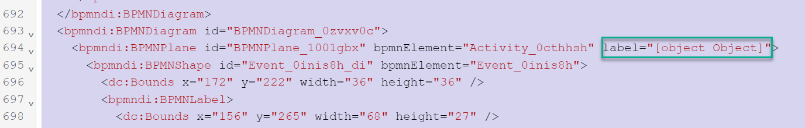
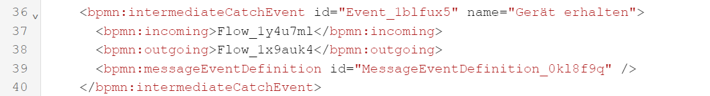
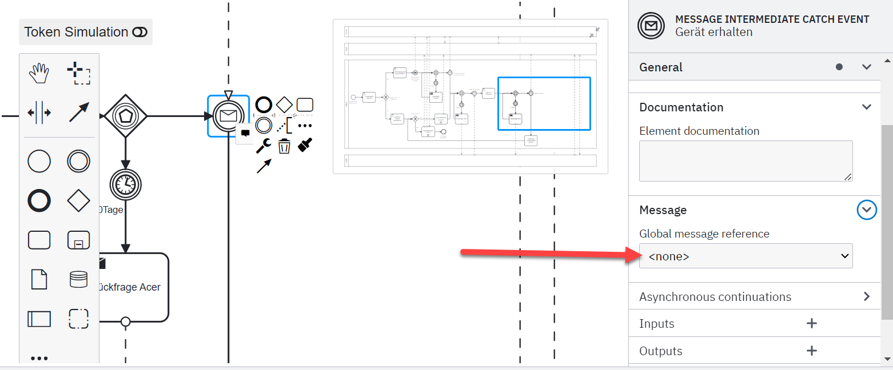

# Gemachte Erfahrungen

In diesem Kapitel werde ich meine Semesterarbeit reflektieren.

[Quelle](../Quellenverzeichnis/index.md#erfahrungen)

# Probleme

## Github CI/CD Pipeline für Github Pages

Anfangs hatte ich Probleme Github Pages für meine Semesterarbeit einzurichten und wusste nicht ganz wo anfangen. Ich wusste aber, dass Yves Wetter von meiner Klasse bereits damit gearbeitet hat und konnte ihn um Hilfe bitten. Was ich falsch gemacht habe, war das vorgesehen Repository, mit dem enthaltenen Jeykill-Template, in meines zu klonen, damit Github die Dateien erhält, um somit dann das Jeykill Template auf Github Pages bauen und hosten zu können.

## Camunda BPMN

Das Erstellen des BPM im *Camunda Modeler* hat sehr gut funktioniert. Was dann jedoch problematisch wurde, war das Hochladen des modellierten BPMN auf den Camunda Container. Ich erhielt einige Fehlermeldungen, welche ich länger versucht habe zu lösen, leider ohne Erfolg. Dies hatte zur Folge, dass ich nicht weiter arbeiten konnte.

- Ich erhielt jedes Mal beim Öffnen vom *Camunda Modeler* folgende Fehlermeldung 

"..\[Grundgeruest.bpmn] unknown attribute <label> [ warning ]"

Ich konnte dann zusammen mit dem Fachexperten Thomas Kälin das Problem beheben. Ich musste dazu das modellierte BPMN im XML Format anzeigen lassen und jeden "Label" Eintrag löschen.

- Ich konnte das BPMN nicht auf den Container laden wegen diverser *MESSAGE INTERMEDIATE CATCH EVENT* errors (Zeile 39). Diese habe ich erhalten, weil im ich im Modeler vergessen habe für diese eine *Global message reference* zu definieren. Diese wird später verwendet, um über die REST-API Nachrichten an Camunda zu senden, damit der Prozess weiterlaufen kann [Messaging](../Hauptteil/3.4_Improve.md#messaging). 

Ich konnte das Problem beheben, indem ich auf dem Aufruf-Aktivitäten* oder *Call-Activitiys* unter *Message -> Global message reference* einen Wert eingetragen habe. Wie vorhin beschrieben, ist dieser wichtig um dann die REST-API Abfrage durchführen zu können.

- Ich musste für das Verwenden des BPMN im Container einige Symbole anpassen. So musste ich die *Aufruf-Aktivitäten* oder *Call-Activitiys* in herkömmliche *Tasks* anpassen. Beim Verwenden von *Call-Activitys* wird verlangt, dass ein externer Prozess aufgerufen wird. Das stimmt für den Prozess soweit auch, nur habe diese externe Prozesse nicht modellieren können, weil dies der Rahmen der Semesterarbeit gesprengt hätte. Leider musste ich auch die *MESSAGE INTERMEDIATE THROW EVENT'S* anpassen. Hier war ein ähnliches Problem. Camunda will bei diesem Aufgaben-Typ eine Nachricht versenden. Diese hätte ich z.B. mittels JavaScript konfigurieren können. Da ich aber noch nie mit JavaScript gearbeitet habe und die Zeit nicht gereicht hat mich einzuarbeiten, habe ich mich dafür entschieden die Symbole anzupassen und daraus ein *User Task* zu erstellen, was nicht falsch ist. Das Automatisieren des Mailprozess kann zu einem späteren Zeitpunkt noch umgesetzt werden.

## Azure Container Hosting

Während der Semesterarbeit hatte ich auch externe Abhängigkeiten. Ich hatte mir als Ziel gesetzt, den Camunda-Container in einem Azure-Container zu hosten. Diesen wollte ich auf dem Tenant der ISAG betreiben. Als ich soweit war diese Einrichtung vorzunehmen, musste ich feststellen, dass mein Account keine Azure Subscription für den ISE Tenant hat. Da die zuständige Person zu dieser Zeit sehr ausgelastet war, musste ich einige Zeit warten, um dann schlussendlich den Container erfolgreich in Betrieb nehmen zu können.

# Lessions Learned

Ich hätte mich im Vorhinein mehr über Camunda informieren können. Dann hätte ich die Probleme, welche ich während der *Improve Phase* hatte, umgehen können. Ich habe die externe Abhängigkeit für das Aufsetzen des Azure Container vergessen und nicht als Risiko aufgelistet. Dies hatte zur Folge, dass ich eine kleine Verzögerung hatte. Ich war zum Glück dem Zeitplan voraus und hatte somit einen Puffer.

# Reflexion der ganzen Semesterarbeit

Rückblicken auf die erste Semesterarbeit, habe ich einige Fortschritte gemacht. Ich konnte wie geplant die Dokumentation auf Github Pages hosten, was mir viel Freude bereitet. Den Zeitplan habe ich dieses Mal besser umgesetzt und bin dadurch nie in Zeitnot geraten. Dadurch, dass ich in dieser Semesterarbeit etwas Technisches umsetzen konnte, war meine Motivation stetig präsent. Ich denke, dass ich die zukünftigen Semesterarbeiten auch wieder mit Github Pages hosten werde. 

Ich finde, dafür dass ich das erste Mal mit der Qualitätsmanagement Methode *Lean Six Sigma* gearbeitet habe, ist mir die Umsetzung sehr gut gelungen. Ich konnte den internen Prozess *Garantiefall Reparatur* erfolgreich Aktualisierung und Visualisierung.

Das Arbeiten mit Camunda hat mir ebenfalls viel Freude bereitet und ich habe viel dazu gelernt. Ich werde aber die Umsetzung für die ISEAG vermutlich nochmals in Camunda 8 aufbauen, da Camunda 8 über mehr integrierte und automatisiert Tools verfügt.

Im Grossen und Ganzenanzen war die 2. Semesterarbeit in meinen Augen ein Erfolg.