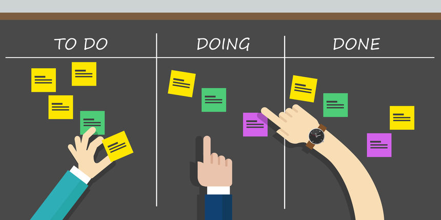
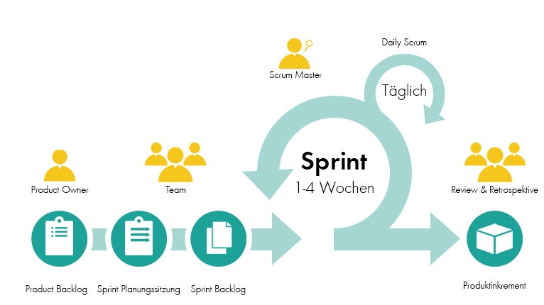
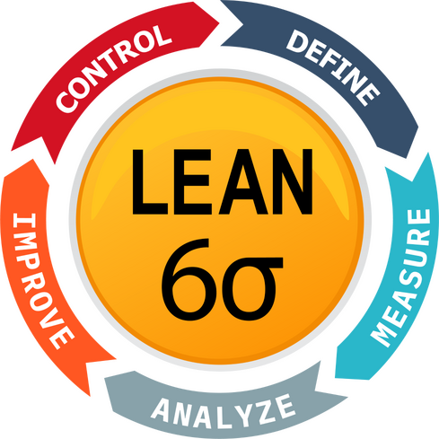

# Projektmanagement-Methode

## Kanban

Kanban ist eine agile Projektmanagement-Methode, die auf der Visualisierung von Arbeitsabläufen basiert. Es handelt sich um ein System von Karten, die die Arbeiten darstellen, die zu erledigen sind, sowie den Fortschritt, der bereits gemacht wurde. Kanban ermöglicht es Teams ihre Arbeiten zu organisieren, zu visualisieren und zu optimieren, indem es den Fokus auf die Steuerung des Workflows und die Vermeidung von Überlastung legt.

Kanban-Boards zeigen den aktuellen Stand der Arbeit an und helfen, den Arbeitsfluss zu verbessern, indem sie Engpässe aufdecken und Verbesserungspotential aufzeigen. Kanban fördert auch die Zusammenarbeit im Team und die kontinuierliche Verbesserung des Arbeitsprozesses.
Kanban kann auch sehr gut für kleine Projekte, an welchen nur eine Person arbeitet, verwendet werden.

[Quelle](../Quellenverzeichnis/index.md#kanban-board)
## Scrum

Scrum ist ein Rahmenwerk für eine spezifische Methode des Projektmanagements. Es zeichnet sich durch effiziente Prozesse, schrittweise Entwicklung und regelmäßige Feedbackschleifen aus. Obwohl es ursprünglich hauptsächlich in der Softwareentwicklung angewendet wurde, findet es mittlerweile breite Anwendung in verschiedenen Branchen.

Im Fokus von Scrum steht ein inkrementeller, iterativer Ansatz. Durch aufeinanderfolgende, eigenständige Phasen (Sprints) werden unterschiedliche Versionen eines Produkts erstellt. Diese Sprints werden fortlaufend wiederholt, bis ein zufriedenstellendes, vollständiges Produkt entsteht.

[Quelle](../Quellenverzeichnis/index.md#scrum-methode)
## Kanban und Scrum in meiner Semesterarbeit

Während meiner Semesterarbeit werde ich mit der Projektmanagement-Methode *Kanban* und *Scrum* arbeiten. Kanban ist in Github bereits integriert, in welchen man Boards und Tasks selbst erstellen kann. So habe ich in Form von "Issues" meine Arbeiten, welche zu erledigen sind, aufgelistet. Mit Kanban kann ich sehr effizient arbeiten und sehe stetig meine Fortschritte. Mittels der verschieden Stati, sehe ich, an welchen Themen ich gerade arbeite oder welche abgeschlossen wurden. 

In Github Projekts kann man für Kanban verschiedene Ansichten erstellen. So habe ich verschiedene Gantt-Diagramme erstellt, in welchen man den ganzen Projektfortschritt verfolgen und überprüfen kann. Um die Arbeit voranzutreiben, werde ich Scrum-Sprints arbeiten, welche auch Voraussetzungen der Semesterarbeit sind, womit ich meine Zwischenziele auswerten und reflektieren kann. Während der Semesterarbeit gibt es insgesamt 3 Sprints.

Hier findet man den Link zu meinem Projektmanagement:

[2 Semesterarbeit - BPM](https://github.com/users/Bazzako/projects/3/views/4)

Da ich alleine an der Semesterarbeit arbeite, bin ich alle Scrum Rollen in einem, daher fallen auch die Daily Scrum's weg. 

## Lean Six Sigma

Für die Analyse, Verbesserung und Erneuerung des Prozesses, werde ich *Lean Six Sigma* verwenden.
*Lean Six Sigma* ist eine systematische Vorgehensweise, die Prozesse aus Sicht des Kunden optimiert. Gemeint sind Dienstleistungen, Produkte und Prozesse, die so angelegt sind, dass sie den Anforderungen des Kunden gerecht werden.

Was sind die Ziele von *Lean Six Sigma* ? Diese Qualitätsmanagement Methode konzentriert sich darauf, Komplexität eines Prozesses zu reduzieren, die Kundenzufriedenheit zu steigern, die Arbeitszyklen zu verkürzen, Verschwendungen zu eliminieren, die Effizienz zu steigern und Defekte und Fehler zu minimieren. 

Diese Ziele werde mittels *Lean* und *DMAIC-Zyklus* erreicht.

*D - Define, M - Measure, A - Analyze, I - Improve, C - Control* 

**Define:** In der *Define-Phase* wird genau festgelegt, welchen Zielzustand man für den zu optimierenden Prozess erwartet. Weiter werden Vermutungen angestellt, wieso dieser Zustand noch nicht erreicht ist, und legt den Ressourceneinsatz (Mitarbeiter, Zeit, Geld, Materialien, etc.) fest. Hierfür werden vor allem Planungs- und Analysemethoden eingesetzt.

**Measure:** In der *Measure-Phase* der Six Sigma Methode wird ermittelt, wie gut der Prozess im Ist-Zustand die Anforderungen des Kunden erfüllt.

**Analyze:** In der *Analyse-Phase* werden aus den gewonnenen Daten die Ursachen für die Abweichung vom geplanten Idealzustand des Prozesses herausgearbeitet.

**Improve:** In der *Improve-Phase* werden die in den vorangegangenen Schritten gewonnen, Erkenntnisse verarbeitet, Massnahmen und Lösungen entwickelt und umgesetzt. Um die gewünschten Effekte und Ziele zu erreichen, werden die Massnahmen unmittelbar getestet.

**Control:** Nach der Implementierung der geplanten Schritte wird der Produktivbetrieb wieder aufgenommen. Dieser wird mit dazugehörigen Messverfahren überwacht, um sicherzustellen, dass die geplanten Ziele nachhaltig erreicht werden.

[Quelle](../Quellenverzeichnis/index.md#lean-six-sigma)
