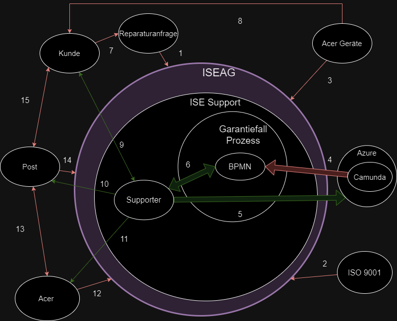

# SEUSAG

Um die Systemabgrenzungen zu veranschaulichen, habe ich ein SEUSAG erstellen. Somit werden Systemgrenzen geklärt, Einflussgrössen ermittelt, Unter - / Teilsysteme isoliert, Schnittstellen definiert, Analysen von Elementen - Dimensionen und Beziehungen erstellt und Gemeinsamkeiten erkannt.

Hier werden die einzelnen Schnittstellen beschrieben. Die Nummerierung dient lediglich der Zuweisung und hat keinerlei Bedeutung für den Ablauf.

1. Die ISEAG erhält eine Reparaturanfrage
2. Die ISEAG ist ISO 9001 zertifiziert und hat daher gewisse Pflichten bezüglich interner Prozesse einzuhalten
3. Die ISEAG ist Acer Partner und vertreibt daher Acer Geräte
4. Der Camunda Conainter wird in Azure gehosted, mit welchem das BPMN erstellt und bearbeitet wird
5. Der Supporter greift via Azure auf Camunda zu
6. Der Supporter arbeitet die BPMN Tasks Prozesse durch
7. Der Kunde erstell Reparaturanfragen
8. Der Kunde hat Acer Geräte
9. Der Kunde und der Supporter stehen direkt miteinander in Kontakt
10. Der Supporter bringt Pakete zu der Post
11. Der Supporter steht mit Acer in Kontakt
12. Acer steht mit der ISEAG in Kontakt
13. Acer bringt Pakete zu der Post / Die Post liefert Pakete an Acer
14. Die Post liefert Pakete an die ISEAG
15. Der Kunde bringt Pakete zu der Post / Die Post liefert Pakete an den Kunden

Die dicken Pfeile (4,5,6) symbolisieren technische Schnittstellen