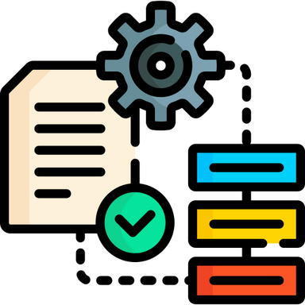
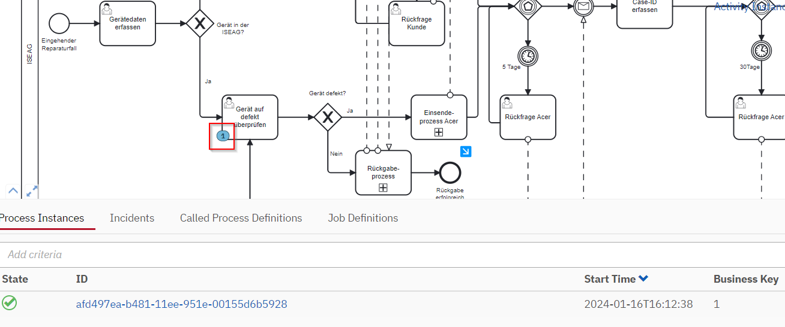
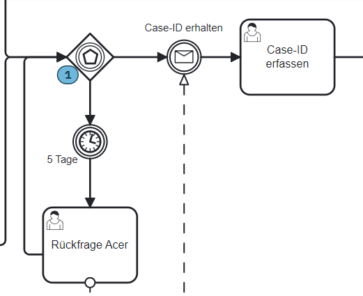
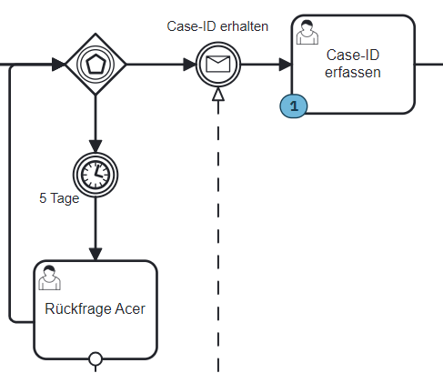
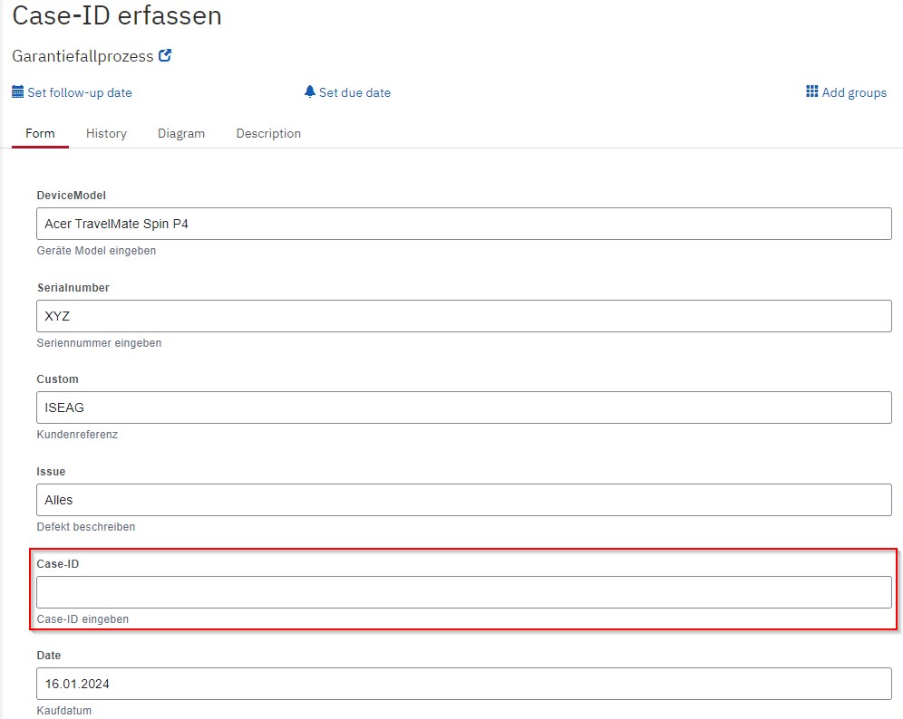
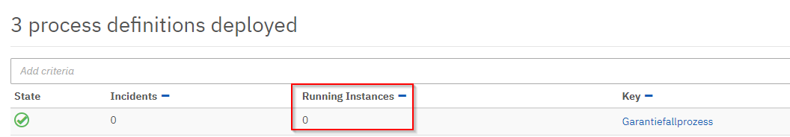
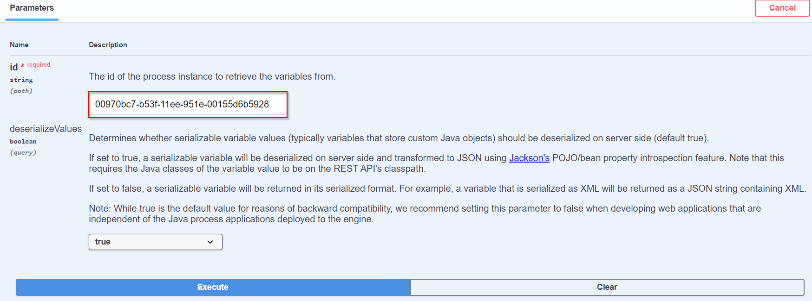

# Control Phase

Da ich mit der Qualitätsmanagementmethode *Lean Six Sigma* arbeite, werde ich Schritt für Schritt den *DMAIC* Zyklus durchgehen und somit den Prozess zu bearbeiten. 

Der fünfte Schritt dazu ist die *Control Phase*. Was in dieser Phase genau geschieht, wird in der Einleitung unter Punkt 2.5 Projektmanagement-Methode beschrieben.




[Quelle](../Quellenverzeichnis/index.md#control)

Die *Control Phase* dient einer längeren Zeitperiode. Der angepasste Prozess wird so fortlaufen auf seine Nachhaltigkeit und Optimierungsmöglichkeit überprüft. 

Bis Camunda den momentanen Reparaturprozess der ISEAG ablösen kann, dauert es noch eine Weile. Da die Semesterarbeit endlich ist, kann ich keine Langzeitstudien für meinen Prozess durchführen und dokumentieren.

Ich habe aber während der *Improve Phase* fortlaufen Tests durchgeführt, um zu kontrollieren, ob der Prozess im Camunda auch durchläuft und abgeschlossen wird.

## Testing

Um das Testing durchzuführen, habe ich einfach diverse Szenarien durchgespielt, welche eintreten könnten. Um zu überprüfen, ob die Prozessinstanz sich am richtigen Ort befinden, kann man in Camunda mittels Cockpit diese grafisch nachverfolgen.



Spannend ist es bei den *eventbasierten Gateways* geworden, da der Prozess auf ein *zeitliches Ereignis* oder eine *empfangene Nachricht* reagiert. So musste ich die REST-API Schnittstellen von Camunda verwenden. 



Mit dem *Messaging* im Swagger UI von Camunda kann man jetzt eine Nachricht generieren, welche von diesem *MESSAGE INTERMEDIATE CATCH EVENT* empfangen wird. Die Abfrage sieht wie folgt aus:

```
{
  "messageName" : "Case-ID erhalten",
  "businessKey" : "1",
  "processVariables" : {
    "Erhalten" : {"value" : "Case ID erhalten", "type": "String"
    }
  }
}
```

Wo man diese eingibt, wird in der [Improve Phase](3.4_Improve#messaging) beschrieben.

Das Ergebnis sieht dann wie folgt aus:



Wie man sehen kann, muss nun wieder der User den Task übernehmen und weitere Informationen in das Camunda Forms, in diesem Fall *Case-ID*, nachtragen.




So habe ich alle Szenarien durchgespielt und überprüft, ob die Prozessinstanzen schlussendlich abgeschlossen wurden.



Über die REST-API können nun auch Informationen zu der laufenden Prozessinstanz aufgefordert werden. Diese werden dann direkt im Swagger UI als JSON angezeigt. Um die Abfrage durchführen zu können, muss man auf im Swagger UI unter *Process Instance* dann */process-instance/{id}/variables*. 

[Camunda Platform REST API](http://test-camunda.e9hpdqayfhhrc6b0.switzerlandnorth.azurecontainer.io:8080/swaggerui/#/Process%20Instance/getProcessInstanceVariables)

Unter *id* muss die ID der Prozessinstanz eingegeben werden. Diese findet man unter dem Cockpit in Camunda oder kann auch über die REST-API angefragt werden.


Nach dem *Execute* wird die angeforderte Information angezeigt. Der Output sieht dann wie folgt aus

```json
{
  "DeviceModel": {
    "type": "String",
    "value": "Acer TravelMate Spin P6",
    "valueInfo": {}
  },
  "Defekt": {
    "type": "Boolean",
    "value": true,
    "valueInfo": {}
  },
  "Case-ID": {
    "type": "String",
    "value": "",
    "valueInfo": {}
  },
  "Issue": {
    "type": "String",
    "value": "Alles",
    "valueInfo": {}
  },
  "Warranty": {
    "type": "Boolean",
    "value": true,
    "valueInfo": {}
  },
  "OneDrive": {
    "type": "Boolean",
    "value": true,
    "valueInfo": {}
  },
  "Customer": {
    "type": "String",
    "value": "ISEAG",
    "valueInfo": {}
  },
  "Serialnumber": {
    "type": "String",
    "value": "avwiepafijsdv",
    "valueInfo": {}
  },
  "ISEAG": {
    "type": "Boolean",
    "value": true,
    "valueInfo": {}
  },
  "Date": {
    "type": "String",
    "value": "17.01.2024",
    "valueInfo": {}
  }
}
```

Wie man sehen kann, sind hier alle abgefüllten Variablen der angegebenen Prozessinstanz aufgelistet.