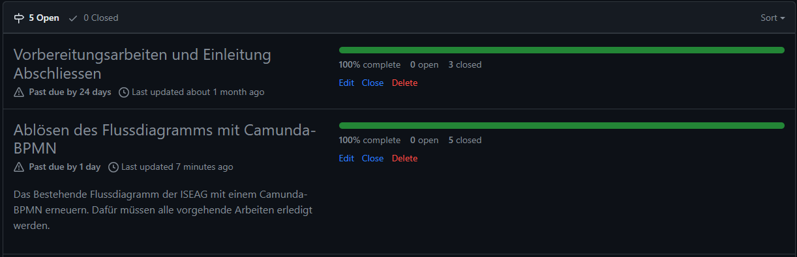
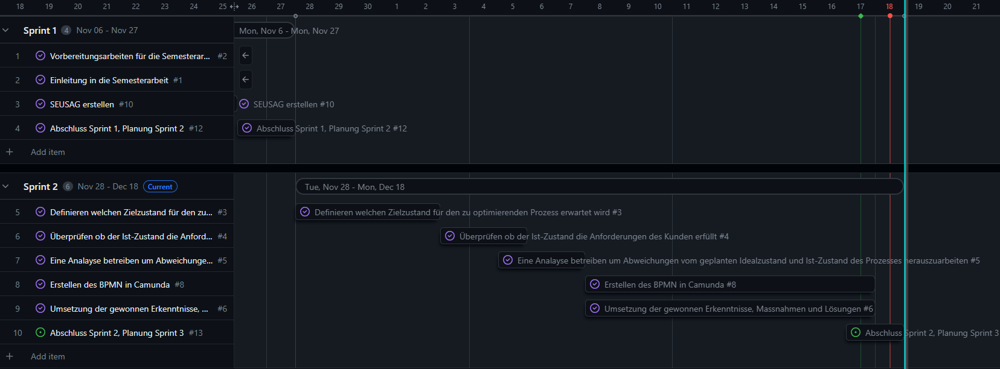
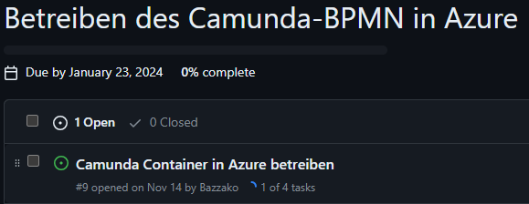
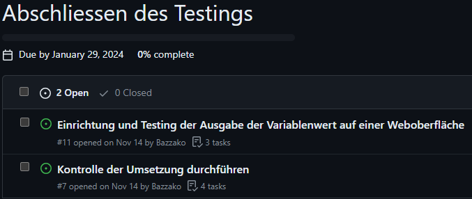
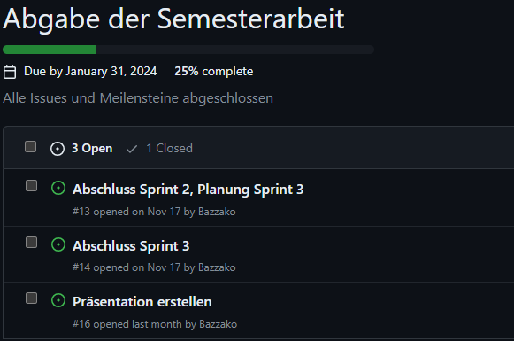

# 2. Sprintabschluss

Rückblicken auf den ersten Sprint kann ich sagen, dass ich gut im Zeitplan liege. Ich konnte alle Vorarbeiten für die Umsetzung und die Umsetzung selbst (Improve) durchführen. Das bestehende Flussdiagramm wurde somit erfolgreich in ein BPMN überführt. Somit sind nun 2 Meilensteine der Semesterarbeit erfolgreich abgeschlossen.

[Milestones - Bazzako/SemArb2-BPM](https://github.com/Bazzako/SemArb2-BPM/milestones)

Im Gantt-Diagramm (Gantt Nach Sprints) sieht es aktuell wie folgt aus. Der blaue Strich visualisiert das Ende des 2.Sprints.

[Gantt Nach Sprints · 2 Semesterarbeit - BPM](https://github.com/users/Bazzako/projects/3/views/4)

## Wie stehe ich im Zeitplan ?

Ich liege wie geplant im Zeitplan. Meinen Vorsprung, welchen ich im Sprint 1 erarbeitet habe, konnte ich leider nicht weiter ausbauen, da die Arbeit im Geschäft wieder angezogen hat. 

## Was ist mir gut gelaufen, worauf baue ich auf ?

Ich bin immer noch sehr motiviert und kann diese Motivation über die ganze Semesterarbeit hinweg aufrechterhalten. Da ich im 2. Sprint endlich etwas umsetzen konnte, hat mir das einen weiteren Motivationsschub gegeben. Das Erarbeiten des BPMN hat mir viel Freude bereitet, da dieses später auch in der Firma eingesetzt wird.

## Blick auf den 3.Sprint

Ich liege gut im Zeitplan, darf aber die Arbeiten im letzten Sprint nicht unterschätzen und muss dran bleiben. Im 3.Sprint gibt es weitere Praxisarbeiten zu überwinden. Ausserdem müssen wir für diese Semesterarbeit die erste Präsentation halten, für welche die Vorbereitung weitere Ressourcen in Kauf nimmt.

Im 3.Sprint müssen folgender Meilenstein vollenden werden.

