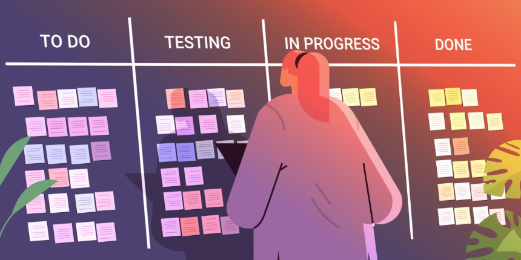
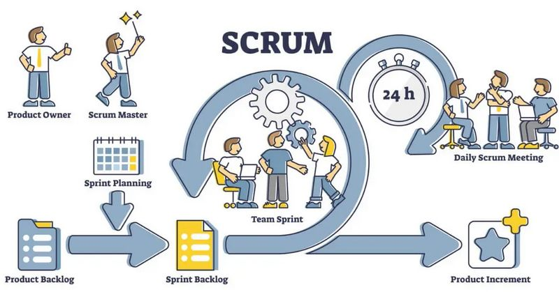

# Projektmanagement-Methode

## Kanban
Das **Kanban-System** ist eine agile Arbeitsmethode aus dem Projektmanagement, welche dabei hilft, die Zusammenarbeit von Teams zu verbessern. Durch die Visualisierung von Arbeitsprozessen können diese verwaltet und verbessert, sowie deren Effizienz und Qualität gesteigert werden. Die Arbeitsschritte werden dabei (digital) einzeln auf Tafeln dargestellt und in Verantwortlichkeiten unterteilt, sodass selbst komplexe Projekte für alle Beteiligten übersichtlich und leicht verständlich gemacht werden.

Das Kanban-System ermöglicht es durch seine Struktur zudem, konsistente Arbeitsabläufe zu gewährleisten, auf die sich Mitarbeiter und weitere am Projekt Beteiligte besser einstellen und so etwa besser Ressourcen einplanen können. Da das System kontinuierlich mit dem aktuellen Entwicklungsstand abgeglichen wird, ist auch eine ständige Verbesserung möglich, da Schwachstellen so leicht bemerkbar werden.
Kanban kann auch sehr gut für kleine Projekte, an welchen nur eine Person arbeitet, verwendet werden.

## Scrum
**Scrum** ist ein Framework für eine bestimmte Art des Projektmanagements. Es zeichnet sich durch schlanke Prozesse, schrittweise Entwicklung und regelmäßige Feedbackschleifen aus. Ursprünglich wurde es vor allem in der Softwareentwicklung eingesetzt, mittlerweile findet es aber in vielen weiteren Branchen Anwendung.

Scrum verfolgt einen inkrementellen und iterativen Ansatz. In aufeinanderfolgenden, eigenständigen Phasen, den sogenannten Sprints, werden verschiedene Versionen eines Produkts entwickelt. Diese Sprints werden kontinuierlich wiederholt, bis ein zufriedenstellendes und vollständiges Produkt erreicht ist.

## Kanban und Scrum in dieser Semesterarbeit

In meiner Semesterarbeit werde ich mit Kanban und Scrum arbeiten. 
Weshalb gleich mit beiden Methoden?
Kanban ist in Github bereits integriert, in welchen man Boards und Tasks selbst erstellen kann. Zusätzlich kann ich verschiedene Ansichten erstellen, wie beispielsweise eine Gant-Projektübersicht, etc. 
Zusätzlich verwende ich die Sprints, welche in Scrum integriert sind. Da ich jedoch alleine bin, habe ich bei mir nur 3 Sprintgespräche eingeplant. Dies, weil die Daily Sprints wegfallen, da ich die Semesterarbeit als Einzelarbeit mache, somit bin ich Zeitgleich auch der Scrum-Master. 

Dies ist der Link zu meinem Projektmanagement:
<a href="https://github.com/users/Radball-Migi/projects/3/views/4" target="_blank">Roadmap · HF ITCNE24 - 2 Semarbeit BPMN</a>

## Six Sigma

