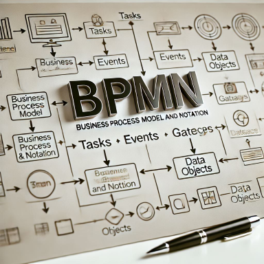

# Hauptteil

Mithilfe der Qualitätsmanagementmethode Six Sigma, möchte ich den DMAIC-Zyklus Schritt für Schritt durchgehen und so den Prozess meiner Zielsetzung näherbringen. 
Wie genau der DMAIC-Zyklus abläuft, wurde bereits in der Einleitung unter dem [Punkt 2.5](../Einleitung/25_projektmanagement-methode.md#six-sigma) erläutert.

[Quelle](../Quellverzeichnis/index.md)

