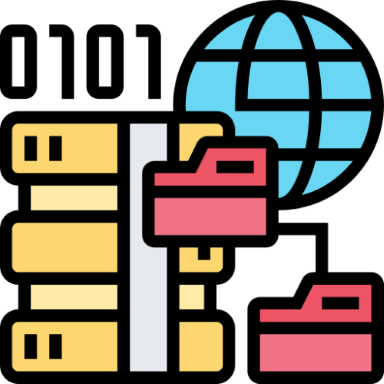

# Quellverzeichnis

[Quelle](#Quellverzeichnis-Logo)

## Bilder

### Startseite
Bild mit KI generiert (<a href="https://copilot.cloud.microsoft/" target="_blank">Microsoft Copilot</a>) 

### Einleitung

#### Ausgangslage
Bild mit KI generiert (<a href="https://copilot.cloud.microsoft/" target="_blank">Microsoft Copilot</a>)
#### Ziele
<a href="https://www.flaticon.com/free-icon/goals_10605945?term=goal&related_id=10605945" target="_blank">Flaticon</a> 

Kanban: [Kanban – Prozesse visualisieren und verbessern](https://ifm-business.de/aktuelles/business-news/kanban-prozesse-visualisieren-und-verbessern.html)

Scrum: [Scrum – das agile Framework in der Bildung - vlbs.nrw](https://vlbs.nrw/event/scrum-agiles-lernen/) 

### Quellverzeichnis-Logo
<a href="https://www.flaticon.com/free-icon/data-source_5865926?term=source&related_id=5865926" target="_blank">Flaticon</a> 

